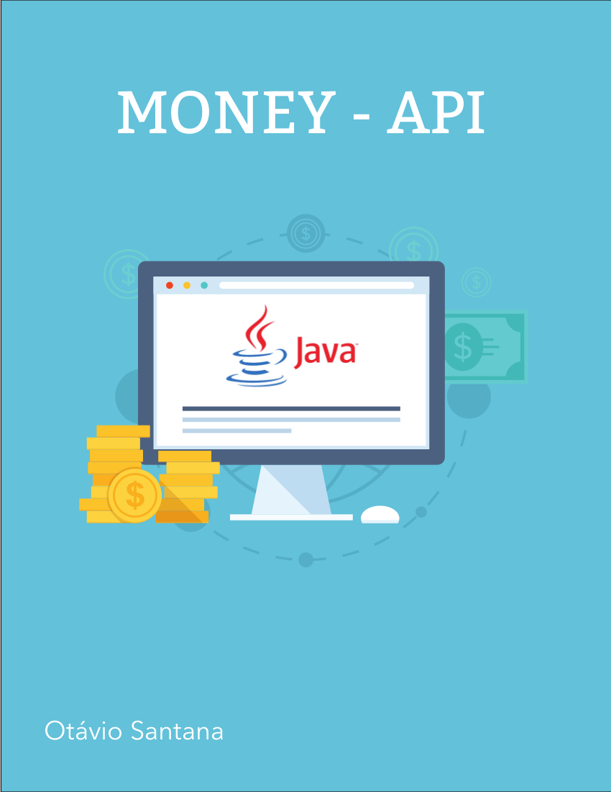

# Introduction

Most software projects deal with monetary values. Primitive wrappers like `Float` and `Double` or richer types like `BigDecimal` are sometimes used to represent monetary values. On the other hand, we often develop or use third-party APIs that offer abstraction for representing money. So clearly it's a very common problem that requires a common standard.

The **JSR 354** (Money and Currency API) is a work towards defining an API that provides abstraction for  money and currency.
